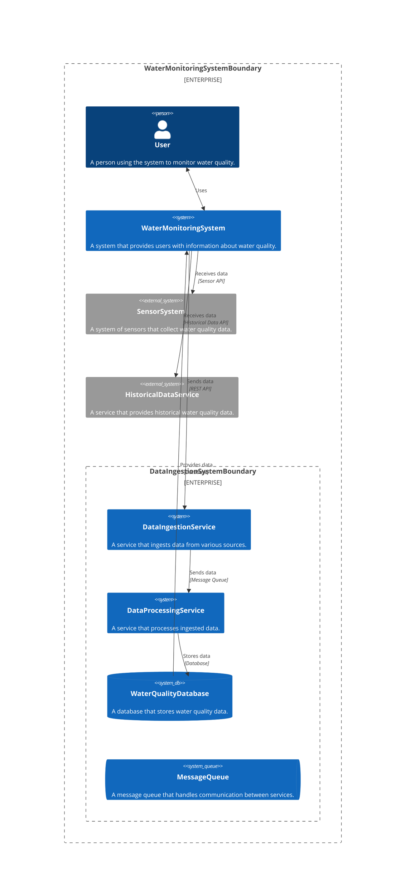

# C4 Context Diagram

```mermaid
C4Context
Enterprise_Boundary(b0, "WaterMonitoringSystemBoundary") {
  Person(user, "User", "A person using the system to monitor water quality.")
  System(SystemA, "WaterMonitoringSystem", "A system that provides users with information about water quality.")
  Enterprise_Boundary(b1, "DataIngestionSystemBoundary") {
    System(SystemB, "DataIngestionService", "A service that ingests data from various sources.")
    System(SystemC, "DataProcessingService", "A service that processes ingested data.")
    SystemDb(SystemD, "WaterQualityDatabase", "A database that stores water quality data.")
    SystemQueue(SystemE, "MessageQueue", "A message queue that handles communication between services.")
  }
  System_Ext(SystemF, "SensorSystem", "A system of sensors that collect water quality data.")
  System_Ext(SystemG, "HistoricalDataService", "A service that provides historical water quality data.")
}
BiRel(user, SystemA, "Uses")
Rel(SystemA, SystemB, "Sends data", "REST API")
Rel(SystemB, SystemC, "Sends data", "Message Queue")
Rel(SystemC, SystemD, "Stores data", "Database")
Rel(SystemD, SystemA, "Provides data", "Database")
Rel(SystemA, SystemF, "Receives data", "Sensor API")
Rel(SystemA, SystemG, "Receives data", "Historical Data API")

UpdateLayoutConfig($c4ShapeInRow="3", $c4BoundaryInRow="1")
```